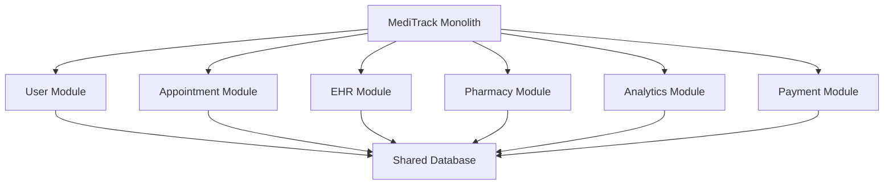
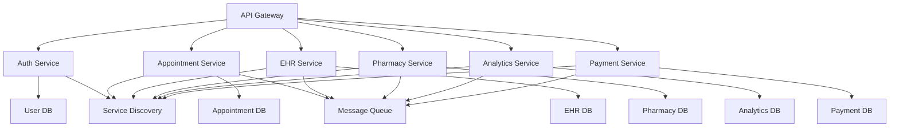

# Case Study 2: MediTrack Transformation

## 1. Use Case Berdasarkan Case Study

MediTrack adalah aplikasi kesehatan yang saat ini diimplementasikan sebagai aplikasi monolitik Java. Semua modul (User, Appointment, EHR, Pharmacy, Analytics, Payment) terintegrasi dalam satu codebase yang saling terikat erat. Perusahaan ingin mentransformasi ke arsitektur microservices untuk meningkatkan skalabilitas, maintainability, dan integrasi masa depan.

Use case utama:
- **Manajemen Pengguna**: Registrasi, login, dan manajemen profil pengguna (admin, dokter, pasien, apoteker).
- **Penjadwalan Janji Temu**: Pasien dapat memesan janji temu dengan dokter, dokter dapat mengelola jadwal.
- **EHR (Electronic Health Records)**: Penyimpanan dan akses rekam medis pasien.
- **Farmasi**: Manajemen obat, resep, dan inventori farmasi.
- **Pembayaran**: Pemrosesan pembayaran untuk layanan kesehatan.
- **Analytics**: Analisis data untuk wawasan kesehatan dan operasional.

Transformasi ini bertujuan untuk memisahkan modul-modul ini menjadi microservices independen yang dapat dikembangkan, di-deploy, dan diskalakan secara terpisah.

## 2. Architecture Diagram

### Monolithic Architecture

### Microservices Architecture

Arsitektur baru mempertahankan fungsionalitas lama dengan memisahkan modul menjadi layanan independen, menggunakan API Gateway untuk routing, message queue untuk komunikasi asinkron, dan service discovery untuk lokasi layanan.

## 3. Data Architecture

### Monolithic Data Architecture
- **Teknologi Database**: Single shared relational database (e.g., MySQL atau PostgreSQL)
- **Schema**: Semua tabel dalam satu database schema
  - `users` - Informasi pengguna
  - `appointments` - Data janji temu
  - `medical_records` - Rekam medis
  - `prescriptions` - Resep obat
  - `payments` - Data pembayaran
  - `analytics_data` - Data untuk analisis
- **Coupling**: Semua modul mengakses database yang sama, menyebabkan tight coupling dan kesulitan dalam scaling

### Microservices Data Architecture
- **Teknologi Database**: Polyglot persistence - database berbeda per service berdasarkan kebutuhan
  - **Auth Service**: PostgreSQL (relational untuk user data)
  - **Appointment Service**: PostgreSQL (relational untuk scheduling)
  - **EHR Service**: MongoDB (document-based untuk medical records yang fleksibel)
  - **Pharmacy Service**: PostgreSQL (relational untuk inventory)
  - **Analytics Service**: Elasticsearch (search engine untuk analytics queries)
  - **Payment Service**: PostgreSQL dengan encryption (secure financial data)
- **Data Ownership**: Setiap service memiliki database sendiri
- **Data Consistency**: Eventual consistency menggunakan event-driven architecture
- **Data Migration**: Scripts untuk migrate data dari shared DB ke individual DBs

### Data Flow & Integration
- **Sync Communication**: REST APIs untuk real-time data exchange
- **Async Communication**: Message Queue (RabbitMQ/Kafka) untuk events
- **API Gateway**: Centralized routing dan authentication
- **Service Discovery**: Dynamic service location (Eureka/Consul)

## 4. Reasoning & Trade-offs

### Reasoning
- **Skalabilitas**: Microservices memungkinkan penskalaan horizontal per modul berdasarkan beban.
- **Maintainability**: Kode terpisah memudahkan pengembangan dan debugging.
- **Integrasi Masa Depan**: Mudah menambahkan layanan baru tanpa mengganggu yang lain.
- **Technology Diversity**: Setiap microservice dapat menggunakan teknologi yang paling sesuai.

### Trade-offs
- **Deployment Complexity**: Lebih kompleks daripada monolith; memerlukan orchestration tools seperti Kubernetes.
- **Data Consistency**: Tantangan dalam konsistensi data lintas layanan; memerlukan patterns seperti saga atau event sourcing.
- **Network Latency**: Komunikasi antar layanan melalui jaringan lebih lambat daripada method calls internal.
- **Operational Overhead**: Monitoring, logging, dan debugging lebih rumit.

## 5. Migration Strategy

Menggunakan **Strangler Pattern** dengan pendekatan bertahap:

1. **Phase 1: Setup Infrastructure**
   - Buat API Gateway dan service discovery.
   - Siapkan database terpisah untuk setiap modul.

2. **Phase 2: Extract Independent Modules**
   - Mulai dengan modul yang paling sedikit dependensi (e.g., Auth, Payment).
   - Buat microservice baru dan proxy request dari monolith.

3. **Phase 3: Extract Interdependent Modules**
   - Ekstrak modul dengan dependensi (e.g., Appointment, EHR).
   - Gunakan message queue untuk komunikasi asinkron.

4. **Phase 4: Refactor and Optimize**
   - Hapus kode lama setelah semua modul diekstrak.
   - Implementasi circuit breaker dan retry mechanisms.

5. **Phase 5: Full Migration**
   - Deploy semua microservices dan decommission monolith.

## 6. Teknologi yang Dibutuhkan

### Development Technologies
- **Programming Language**: Java 17+
- **Framework**: Spring Boot 3.x untuk microservices
- **Build Tool**: Maven atau Gradle
- **Version Control**: Git

### Infrastructure & Runtime
- **Containerization**: Docker untuk packaging services
- **Orchestration**: Kubernetes untuk deployment dan scaling
- **API Gateway**: Spring Cloud Gateway atau Kong
- **Service Discovery**: Eureka atau Consul
- **Message Queue**: RabbitMQ atau Apache Kafka
- **Monitoring**: Prometheus + Grafana
- **Logging**: ELK Stack (Elasticsearch, Logstash, Kibana)

### Databases
- **Relational**: PostgreSQL untuk structured data
- **Document**: MongoDB untuk flexible medical records
- **Search**: Elasticsearch untuk analytics
- **In-Memory**: Redis untuk caching (optional)

### Security
- **Authentication**: JWT tokens
- **Authorization**: OAuth 2.0 / OpenID Connect
- **API Security**: Rate limiting, CORS
- **Data Security**: Encryption at rest/transit

### Development Tools
- **IDE**: IntelliJ IDEA atau VS Code
- **Testing**: JUnit, Mockito untuk unit tests
- **API Testing**: Postman atau REST Assured
- **CI/CD**: Jenkins, GitHub Actions, atau GitLab CI

### Cloud Platforms (Optional)
- **Deployment**: AWS, Azure, atau Google Cloud
- **Managed Services**: RDS, S3, Lambda functions untuk serverless components